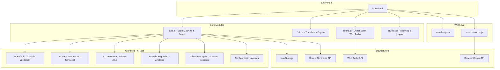
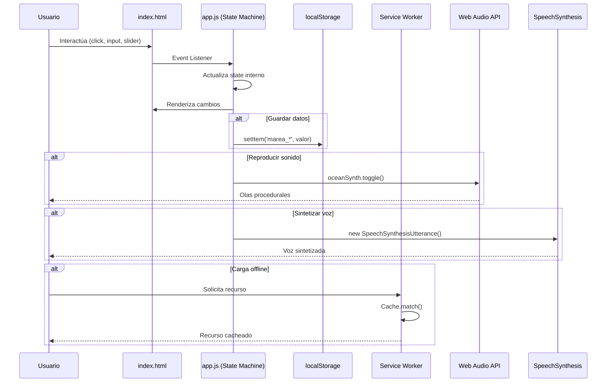
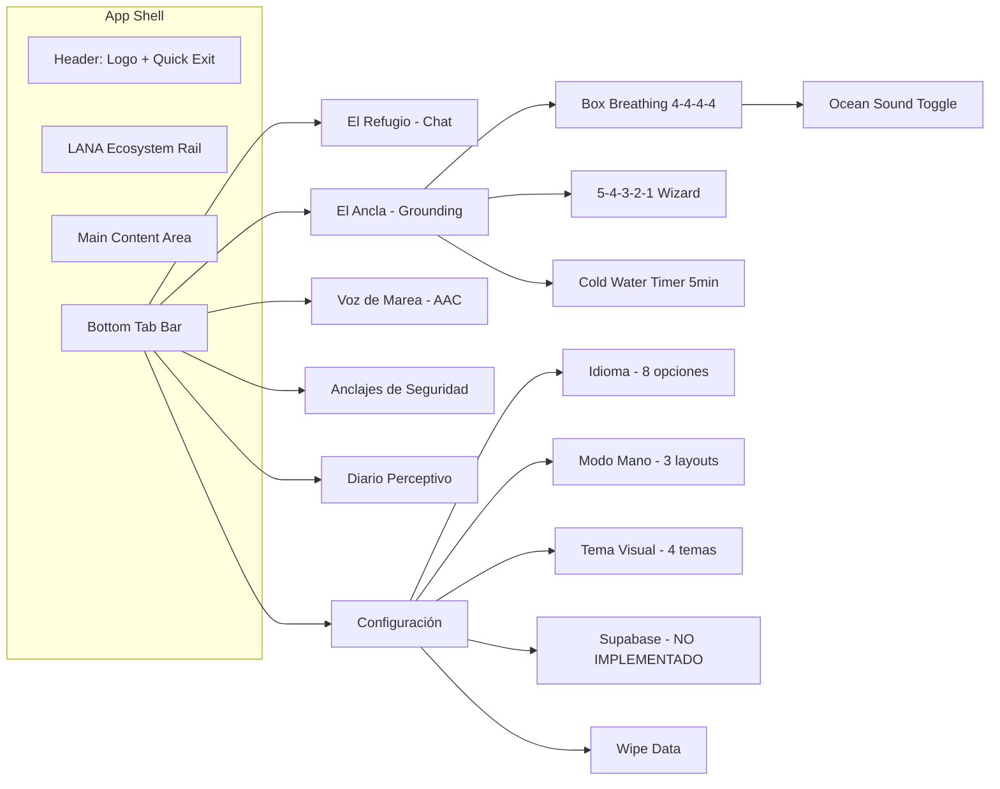

# 🏗️ Análisis Arquitectónico de Marea

## 1. Resumen Ejecutivo

**Marea** es una Progressive Web App (PWA) offline-first diseñada por **Lana Technologies** como herramienta de sostén sensorial, validación conversacional y comunicación aumentativa (AAC) para personas neurodivergentes, supervivientes de ictus con afasia/hemiplejia, y cualquier persona en momentos de crisis o sobrecarga sensorial.

---

## 2. Stack Tecnológico

| Capa | Tecnología | Justificación |
|------|-----------|---------------|
| **Estructura** | HTML5 semántico + ARIA roles | Accesibilidad WCAG 2.1 AA |
| **Estilos** | CSS3 vanilla (custom properties, glassmorphism, animaciones) | Cero dependencias, 4 temas dinámicos |
| **Lógica** | JavaScript vanilla (ES6+) | Sin frameworks, máxima portabilidad |
| **Audio** | Web Audio API (síntesis procedural) | 100% offline, sin archivos de audio |
| **Voz** | Web Speech API (SpeechSynthesis) | TTS nativo offline del navegador |
| **Persistencia** | `localStorage` | Sin servidor, privacidad absoluta |
| **i18n** | Diccionario JS monolítico (8 idiomas) | Traducción instantánea sin recarga |
| **Offline** | Service Worker (Cache-First) | Funcionamiento sin conexión |
| **Instalación** | Web App Manifest | PWA instalable en homescreen |

**Footprint total estimado:** < 200 KB (sin dependencias externas, excepto Google Fonts).

---

## 3. Arquitectura de Componentes



---

## 4. Análisis Módulo por Módulo

### 4.1 [`index.html`](index.html:1) — Estructura Semántica

**Fortalezas:**
- HTML5 semántico con landmarks ARIA (`role="tabpanel"`, `aria-label`, `aria-live="polite"`, `aria-current="page"`)
- Meta tags PWA completos (apple-mobile-web-app, theme-color)
- SVG inline para iconos (cero peticiones adicionales)
- Sistema `data-i18n` y `data-i18n-placeholder` para traducción declarativa
- Navegación inferior tipo tab-bar (mobile-first, thumb-friendly)
- Botón de "Salida Rápida" (`quick-exit-btn`) que redirige a google.com

**Debilidades:**
- Referencia a `icon-192.png` y `icon-512.png` en el manifest pero estos archivos **no existen** en el repositorio → la PWA se instalará sin icono
- Google Fonts carga desde CDN externo → en modo offline absoluto, la tipografía fallback es la única disponible
- El canvas del diario tiene `width="300" height="300"` fijos en HTML, no responsive

---

### 4.2 [`app.js`](app.js:1) — Máquina de Estados Central

**Arquitectura:** Monolito procedural con estado global plano. 895 líneas.

**Estado global (`state`):**
```
lang, theme, handMode, activeTab, activeAnchorSubtab,
chatTimer, chatMessages, lastDefaultIndex,
breathingInterval, breathingState, breathingCycles,
groundingStep, tippTimerInterval, tippTimeRemaining,
aacActiveCategory
```

**Referencias DOM (`elements`):** ~60 referencias directas a nodos del DOM, sin abstracción.

**Funciones principales:**
| Función | Responsabilidad |
|---------|----------------|
| `switchTab()` | Router de navegación entre 6 paneles |
| `switchAnchorSubtab()` | Sub-router para Breathe/Grounding/TIPP |
| `handleUserMsg()` | Motor de chat: detección de idioma, clasificación de intención, respuesta |
| `startBreathingGuide()` | Guía de respiración de caja 4-4-4-4 con animación CSS |
| `renderGroundingStep()` | Wizard 5-4-3-2-1 paso a paso |
| `startTippTimer()` / `resetTippTimer()` | Temporizador 5 min para TIPP |
| `renderAACBoard()` | Renderizado dinámico del tablero AAC |
| `speakText()` | Síntesis de voz multilingüe |
| `drawSensoryCanvas()` | Arte generativo en Canvas 2D según sliders |
| `translateApp()` | Aplicación de traducciones a todo el DOM |

**Fortalezas:**
- Detección de idioma por regex multilingüe en el chat (ES, EN, IT, FR, DE, PT, ZH, JA)
- Clasificación de intención del usuario (how, anxiety, speech, default)
- "Still Here Timer" — tras 25s de inactividad, muestra indicador de presencia
- Síntesis de voz con búsqueda de voz nativa por idioma
- Timer TIPP con formato tabular-nums

**Debilidades:**
1. **Estado global plano y mutable** — no hay encapsulación. Cualquier función puede mutar cualquier parte del estado.
2. **Sin separación de concerns** — lógica de chat, respiración, AAC, diario y settings en un solo archivo monolítico.
3. **Detección de idioma frágil** — usa regex con diccionarios de palabras fijos. Falsos positivos probables (ej: "comment" en inglés coincide con regex francés).
4. **`setInterval` para cuenta atrás de respiración** — se crea un nuevo intervalo cada 4 segundos sin limpiar el anterior (aunque el anterior expira naturalmente). El enfoque es funcional pero frágil.
5. **`alert()` para notificaciones** — bloquea el hilo principal. Mala UX de accesibilidad. No usar en producción.
6. **Sin sanitización de entrada de chat** — el texto del usuario se inserta directamente en `textContent` (seguro), pero no hay límite de longitud ni protección contra spam de burbujas.
7. **`oceanSynth` es una variable global** definida en [`sound.js`](sound.js:138) pero consumida directamente en [`app.js`](app.js:804) sin import/require → acoplamiento fuerte por variable global.
8. **Referencias al DOM por ID cableadas** — si el HTML cambia, el JS se rompe silenciosamente (sin null-checks robustos en todos los casos).
9. **El canvas del diario redibuja en cada `input` de slider** — puede ser costoso en dispositivos lentos. No hay throttling/debouncing.
10. **Supabase mencionado pero no implementado** — el botón "Conectar Cuenta" no tiene funcionalidad real.

---

### 4.3 [`i18n.js`](i18n.js:1) — Motor de Internacionalización

**Arquitectura:** Diccionario estático global (`i18n`) + tablero AAC (`aacBoardData`).

**Idiomas soportados:** Español, English (UK), Italiano, Français, Deutsch, 简体中文, Português, 日本語.

**Estructura de claves:** `seccion.subclave` (ej: `refugio.quick.underwater`).

**Fortalezas:**
- Cobertura completa de 8 idiomas para toda la UI
- Tablero AAC completamente traducido con frases habladas específicas por idioma
- Sistema de placeholders separado (`data-i18n-placeholder`)
- Sin dependencias externas, sin llamadas a API

**Debilidades:**
1. **Archivo de ~1220 líneas con objetos anidados enormes** — difícil de mantener y propenso a errores de sintaxis.
2. **No hay detección de claves faltantes** — si una clave no existe en un idioma, se muestra el key name como fallback.
3. **Los datos AAC están duplicados 8 veces** — mismo icono, estructura idéntica. Solo cambia el texto.
4. **Carga síncrona** — el parser de JS debe cargar y parsear las ~1220 líneas antes de ejecutar cualquier lógica.
5. **No hay soporte para pluralización** ni interpolación de variables.

---

### 4.4 [`sound.js`](sound.js:1) — Sintetizador de Audio Web

**Arquitectura:** Clase `OceanSynth` con pipeline de nodos Web Audio API.

**Pipeline de audio:**
```
NoiseBuffer (ruido blanco en bucle)
  → BiquadFilter (lowpass, ~350Hz)
    → GainNode (volumen 0.25 con fade in/out)
      → AudioContext.destination

LFO (oscilador seno 0.12Hz ~8.3s ciclo)
  → ModulatorGain (profundidad 200Hz)
    → Filter.frequency (modula entre ~150Hz y ~550Hz)
  → VolModulatorGain (0.08)
    → GainNode.gain (modula volumen para efecto de oleaje)
```

**Fortalezas:**
- Síntesis procedural 100% offline, sin archivos de audio
- LFO de ~8.3 segundos imita el ciclo natural de oleaje
- Fade in (2s) y fade out (1.5s) suaves
- Lazy initialization del AudioContext (política de seguridad de navegadores)
- Manejo de `ctx.state === 'suspended'` para navegadores móviles

**Debilidades:**
1. **`OceanSynth` se instancia como variable global** (`const oceanSynth`) — no se exporta como módulo.
2. **No hay limpieza del oscillator al detener** — usa `setTimeout` para delayed cleanup. Si se togglea rápido on/off/on, pueden acumularse timeouts.
3. **El buffer de ruido es de 2 segundos** fijos. Para un loop más natural, un buffer más largo o multiple buffers reducirían la percepción de repetición.
4. **Sin control de volumen maestro** para el usuario — siempre al 25% fijo.

---

### 4.5 [`styles.css`](styles.css:1) — Sistema de Diseño

**Arquitectura:** CSS vanilla con custom properties (variables CSS) y 4 temas.

**Temas:**
| Tema | Clase | Paleta |
|------|-------|--------|
| Deep Sea (default) | `.theme-deep-sea` | Obsidian + Mint bioluminiscente |
| Warm Sand | `.theme-warm-sand` | Arena suave + Ámbar |
| High Contrast | `.theme-high-contrast` | Negro puro + Amarillo #ffff00 |
| Monochrome | `.theme-monochrome` | Escala de grises, sin estimulación cromática |

**Fortalezas:**
- Sistema de theming elegante con variables CSS — cambiar una clase en `<body>` transforma toda la UI
- Glassmorphism con `backdrop-filter: blur()`
- Animaciones sutiles: `fadeIn`, `scaleIn`, `pulse` para el indicador de presencia
- Tipografía Outfit desde Google Fonts (moderna, legible)
- Modos de layout unilateral (left/right/center hand) para accesibilidad motora
- LANA ecosystem rail con grid matrix background sutil
- Diseño mobile-first, `max-width: 500px` en desktop simula un teléfono

**Debilidades:**
1. **Error de sintaxis en línea 759** — hay una llave `}` extra después del bloque `.aac-card-btn:hover .aac-icon`. Esto puede romper reglas CSS posteriores.
2. **Selectores de modos de mano vacíos** — `.mode-left-hand .chat-controls` etc. solo tienen comentarios, sin reglas reales de desplazamiento.
3. **`direction: rtl` en grid AAC para modo zurdo** — enfoque ingenioso pero frágil; invierte el orden visual de todos los items.
4. **No usa `prefers-reduced-motion`** — las animaciones se ejecutan siempre, sin respetar la preferencia del sistema operativo.
5. **No usa `prefers-color-scheme`** — no hay detección automática de modo oscuro del sistema.
6. **Google Fonts como única dependencia externa** — sin la fuente cargada, la experiencia visual se degrada.

---

### 4.6 [`service-worker.js`](service-worker.js:1) — Estrategia de Caching

**Estrategia:** Cache-First con fallback a network.

**Assets cacheados:**
```
./, ./index.html, ./styles.css, ./app.js, ./i18n.js, ./sound.js, ./manifest.json
```

**Fortalezas:**
- Instalación y activación estándar de SW
- Limpieza de caches antiguos en `activate`
- Fallback a `index.html` para navegaciones offline

**Debilidades:**
1. **Faltan los iconos PWA** — `icon-192.png` e `icon-512.png` no están en la lista de assets cacheados ni en el repositorio.
2. **No se cachea Google Fonts** — en modo offline, la fuente no estará disponible.
3. **Estrategia Cache-First sin versionado** — si se actualiza un archivo, el SW seguirá sirviendo la versión cacheada hasta que el usuario limpie manualmente.
4. **Sin notificación de actualización** — el usuario nunca sabe si hay una nueva versión disponible.
5. **`console.log` en producción** — no es crítico pero ensucia la consola.

---

### 4.7 [`manifest.json`](manifest.json:1) — PWA Manifest

**Fortalezas:**
- `display: standalone` para experiencia nativa
- `orientation: portrait` apropiado para uso en crisis
- Colores consistentes con tema Deep Sea

**Debilidades:**
1. **Iconos referenciados pero no existen** — `icon-192.png` e `icon-512.png` no están en el repositorio. La PWA no tendrá icono al instalarse.
2. **Falta `screenshots`** — para PWAs modernas, los screenshots mejoran la experiencia de instalación.
3. **Falta `categories`** — ayudaría en tiendas de aplicaciones/web stores.

---

## 5. Flujo de Datos



---

## 6. Análisis de Seguridad y Privacidad

### 6.1 Privacidad — EXCELENTE

| Aspecto | Evaluación |
|---------|-----------|
| Datos en servidor | ❌ Ninguno. 100% `localStorage` |
| Trackers | ❌ Ninguno |
| Registro obligatorio | ❌ No existe |
| Google Fonts | ⚠️ CDN externo (Google puede ver la IP) |
| Conexiones salientes | ⚠️ Solo LANA ecosystem rail (links externos) + Google Fonts |
| Salida rápida | ✅ Redirige a google.com, pero no limpia `localStorage` ni el historial |

### 6.2 Vulnerabilidades

| Riesgo | Severidad | Descripción |
|--------|-----------|-------------|
| XSS | 🟢 Bajo | Uso de `textContent` en lugar de `innerHTML` para contenido de usuario |
| Datos en texto plano | 🟡 Medio | `localStorage` no está cifrado. Un atacante con acceso físico al dispositivo puede leer los anclajes de seguridad y diarios |
| Sin sanitización de `localStorage` | 🟡 Medio | Al cargar datos con `JSON.parse`, no se valida estructura. Datos corruptos pueden causar errores |
| Sin límites de almacenamiento | 🟢 Bajo | Los logs del diario crecen ilimitadamente. No hay quota management |
| Clickjacking | 🟢 Bajo | No se detecta `X-Frame-Options` (no aplica al ser PWA standalone) |

---

## 7. Análisis de Accesibilidad

### Cumplimiento WCAG 2.1 AA

| Criterio | Estado | Notas |
|----------|--------|-------|
| Roles ARIA | ✅ | `tabpanel`, `tablist`, `tab`, `navigation`, `aria-live`, `aria-label`, `aria-current` |
| Navegación por teclado | ⚠️ | No se detectan handlers de teclado explícitos. Se depende del comportamiento nativo |
| Contraste de color | ✅ | Tema High Contrast específico (#ffff00 sobre #000000). Temas estándar con buen contraste |
| Texto redimensionable | ✅ | Uso de `rem` y unidades relativas |
| `prefers-reduced-motion` | ❌ | No implementado |
| `prefers-color-scheme` | ❌ | No implementado |
| Focus visible | ⚠️ | Algunos inputs tienen `:focus`, pero no hay estilo global `:focus-visible` |
| Idioma del documento | ✅ | `document.documentElement.lang` se actualiza dinámicamente |
| Etiquetas en formularios | ✅ | Todos los inputs tienen `<label>` asociado |

---

## 8. Matriz de Fortalezas y Debilidades

### FORTALEZAS

1. **Cero dependencias.** JS, CSS, HTML vanilla puro. No hay `node_modules`, no hay build step.
2. **Offline-first absoluto.** Todo funciona sin internet: chat, respiración, grounding, AAC, diario.
3. **8 idiomas con detección automática** en el chat.
4. **Síntesis de audio procedural** (Web Audio API) sin archivos de sonido.
5. **Cuatro temas visuales** con sistema de custom properties elegante.
6. **AAC para afasia/hemiplejia** — tablero de comunicación con TTS.
7. **Modelo de privacidad radical** — zero datos en servidor.
8. **Salida rápida** para situaciones de emergencia.
9. **Diseño mobile-first** con modos de una mano.
10. **Filosofía clara y noble** — el README es impecable.

### DEBILIDADES

1. **Arquitectura monolítica** — [`app.js`](app.js:1) de 895 líneas mezcla chat, respiración, AAC, diario y settings.
2. **Estado global mutable** sin encapsulación.
3. **Sin tests** — no hay test suite.
4. **Iconos PWA no existen** en el repositorio.
5. **Error de sintaxis CSS** — llave extra en línea 759 de [`styles.css`](styles.css:759).
6. **`alert()` para UX** — bloqueante e inaccesible.
7. **Sin límites en logs del diario** — `localStorage` puede llenarse.
8. **Sin `prefers-reduced-motion`** ni `prefers-color-scheme`.
9. **Supabase no implementado** — botón sin funcionalidad.
10. **Service Worker sin estrategia de actualización.**
11. **Acoplamiento por variable global** entre [`sound.js`](sound.js:138) y [`app.js`](app.js:804).
12. **Sin soporte para pluralización/i18n avanzado.**
13. **Google Fonts rompe el offline absoluto** en primera carga sin cache.

---

## 9. Diagrama de Navegación



---

## 10. Recomendaciones

### Inmediatas (bugs/críticas)

| # | Acción | Prioridad |
|---|--------|-----------|
| 1 | Crear `icon-192.png` e `icon-512.png` y añadirlos al SW cache | 🔴 Crítica |
| 2 | Corregir error de sintaxis CSS en línea 759 de [`styles.css`](styles.css:759) (llave `}` extra) | 🔴 Crítica |
| 3 | Reemplazar todos los `alert()` por un sistema de toast no bloqueante | 🟡 Alta |
| 4 | Implementar `prefers-reduced-motion` y `prefers-color-scheme` | 🟡 Alta |

### Corto Plazo (mejoras estructurales)

| # | Acción | Prioridad |
|---|--------|-----------|
| 5 | Separar [`app.js`](app.js:1) en módulos: `chat.js`, `breathing.js`, `aac.js`, `journal.js`, `settings.js` | 🟡 Alta |
| 6 | Encapsular estado en un objeto `Store` con getters/setters o usar el pattern Observer | 🟡 Alta |
| 7 | Cachear Google Fonts en el Service Worker para offline completo | 🟢 Media |
| 8 | Añadir límite de logs del diario (ej: últimos 90 días) y quota management | 🟢 Media |
| 9 | Implementar botón de Supabase o eliminarlo de la UI | 🟢 Media |
| 10 | Añadir debounce al redibujado del canvas sensorial | 🟢 Media |

### Largo Plazo (visión)

| # | Acción | Prioridad |
|---|--------|-----------|
| 11 | Migrar a ES Modules con `import`/`export` para eliminar variables globales | 🟢 Media |
| 12 | Considerar IndexedDB en lugar de `localStorage` para datos estructurados (logs del diario) | 🟢 Media |
| 13 | Añadir test suite (Jest/Vitest) para la lógica de detección de idioma e intención | 🟢 Media |
| 14 | Implementar cifrado de `localStorage` con Web Crypto API para anclajes de seguridad | 🟢 Baja |
| 15 | Considerar migración a TypeScript para type safety en la detección de idiomas | 🟢 Baja |

---

## 11. Conclusión

**Marea es una aplicación admirable en su misión y filosofía.** Su pureza técnica (vanilla JS, cero dependencias, offline-first, privacidad radical) es una declaración de principios. Es una herramienta genuinamente útil para personas en situaciones de vulnerabilidad extrema.

El mayor riesgo técnico es la **deuda arquitectónica del monolito** [`app.js`](app.js:1): a medida que crezca, la mantenibilidad se degradará. La modularización es la inversión más importante a futuro.

Los problemas inmediatos son **subsanables en horas**: los iconos PWA faltantes, el error de sintaxis CSS, y los `alert()` bloqueantes. Resueltos estos, Marea es perfectamente funcional y desplegable en producción.

**Nota final:** El código refleja un profundo entendimiento de trauma-informed design. Funcionalidades como la "presencia continua" (Still Here Timer), la salida rápida, y el tablero AAC con frase "Mi cerebro funciona bien, me cuesta hablar" demuestran una empatía poco común en el desarrollo de software.

---

*Análisis generado el 17 de junio de 2026. Arquitectura actual: monolito vanilla JS PWA.*
