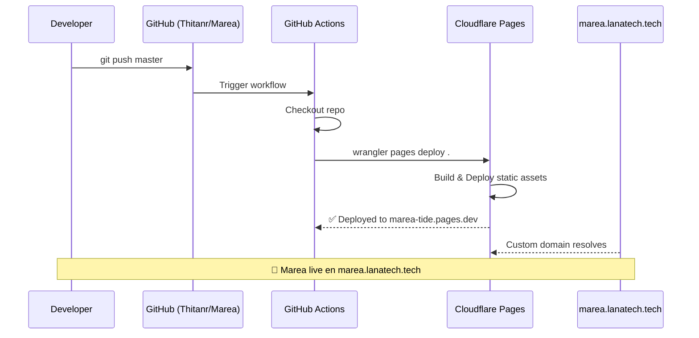

# 🔗 Plan Maestro: Integración de Marea al Ecosistema LANA

## 1. Estado Actual vs. Objetivo

| Aspecto | Marea Actual | LANA Canónico | Acción Necesaria |
|---------|-------------|---------------|-----------------|
| **Background** | `#0B1120` | `#0a0f0d` (lana-canvas) | Alinear a `#0a0f0d` |
| **Accent** | `#96E8D6` / `#00F2FE` | `#4db896` (Sovereign Mint) | Migrar a `#4db896` |
| **Font** | Outfit (Google Fonts) | Inter + JetBrains Mono | Cambiar a Inter |
| **Ecosystem Rail** | Hardcodeado en HTML ✅ | Componente React + `lana-shell.css` | Mantener hardcodeado (Marea es vanilla JS, no React) pero sincronizar CSS |
| **Marea en ecosystem.ts** | ❌ No existe | 6 productos definidos | Añadir "marea" con codename "TIDE" |
| **Iconos PWA** | ❌ No existen | Bragi tiene 4 iconos | Crear iconos usando script de Bragi |
| **CI/CD** | ❌ No existe | GitHub Actions + Wrangler | Crear workflow + añadir a `deploy-cloudflare.ps1` |
| **Repo GitHub** | ❌ No existe | Todos en `Thitanr/*` | Crear `Thitanr/Marea` |
| **Submodulo en AUTOMATION_TOOL** | ❌ No existe | Bragi, videogame, etc. | Añadir `marea/` como submodulo |
| **Supabase** | Mencionado, no implementado | Cloudflare Worker BFF | Integrar opcionalmente |
| **Sonido del mar** | ✅ Web Audio API | - | Mantener (es diferenciador de Marea) |
| **Estados del chat** | ✅ Respuestas predefinidas | - | Migrar a DeepSeek vía Worker (opcional) |

---

## 2. Arquitectura de Despliegue Propuesta

```mermaid
graph TB
    subgraph "Repositorios GitHub"
        R_AUTOMATION[Thitanr/AUTOMATION_TOOL<br/>Mono-repo de control]
        R_MAREA[Thitanr/Marea<br/>Repositorio independiente]
    end

    subgraph "CI/CD Pipeline"
        CI[GitHub Actions<br/>.github/workflows/marea.yml]
        WRANGLER[Wrangler CLI<br/>pages deploy]
    end

    subgraph "Cloudflare"
        CF_PAGES[Cloudflare Pages<br/>marea-tide.pages.dev]
        CF_WORKER[BFF Worker<br/>flat-rain-8eef.workers.dev]
    end

    subgraph "Supabase"
        SB[(Supabase<br/>Proyecto LANA)]
    end

    subgraph "DNS"
        DNS[marea.lanatech.tech]
    end

    R_MAREA --> CI
    CI --> WRANGLER
    WRANGLER --> CF_PAGES
    DNS --> CF_PAGES
    
    CF_PAGES -.->|api/ai/chat| CF_WORKER
    CF_PAGES -.->|api/sync| CF_WORKER
    CF_WORKER --> SB
    CF_WORKER -->|DeepSeek API| DEEPSEEK[(DeepSeek)]

    R_MAREA -- submodulo --> R_AUTOMATION
```

---

## 3. Plan de Acción Detallado

### FASE 1: Fundamentos de Marca y Repositorio (🔴 Crítica)

#### 3.1.1 Verificar y sincronizar repositorio `Thitanr/Marea`
- ✅ **Repo ya existe:** `https://github.com/Thitanr/marea`
- Verificar que el remote `origin` apunta correctamente al repo
- Hacer pull inicial para sincronizar (si hay cambios remotos)
- Push de cualquier cambio local pendiente

#### 3.1.2 Añadir Marea a [`ecosystem.ts`](C:\Users\Hache\OneDrive\Desktop\AUTOMATION_TOOL\packages\brand\ecosystem.ts:7)
```typescript
// Añadir "marea" al tipo LanaProductId:
export type LanaProductId =
  | "lanaos" | "sindri" | "muninn" | "bragi" | "snotra" | "metalattice"
  | "marea";  // ← NUEVO

// Añadir entrada al array LANA_PRODUCTS:
{
  id: "marea",
  name: "Marea",
  codename: "TIDE",
  tagline: "Sovereign holding & sensory anchor",
  port: 3003,
  localUrl: "http://localhost:3003",
  tunnelHost: "https://marea.lanatech.tech",
}
```

#### 3.1.3 Añadir Marea como submódulo en AUTOMATION_TOOL
```bash
cd C:\Users\Hache\OneDrive\Desktop\AUTOMATION_TOOL
git submodule add https://github.com/Thitanr/Marea.git marea
```

#### 3.1.4 Alinear colores CSS de Marea a tokens canónicos LANA
Actualizar [`styles.css`](styles.css:14) — reemplazar los tokens actuales por los canónicos:

| Variable CSS | Marea Actual | LANA Canónico |
|-------------|-------------|---------------|
| `--bg-app` | `#0B1120` | `#0a0f0d` |
| `--bg-card` | `rgba(17, 24, 39, 0.70)` | `rgba(12, 17, 23, 0.70)` |
| `--accent-glow` | `#96E8D6` | `#4db896` |
| `--accent-primary` | `#96E8D6` | `#4db896` |
| `--accent-gradient` | `linear-gradient(135deg, #96E8D6 0%, #3a8a72 100%)` | `linear-gradient(135deg, #4db896 0%, #2d6b58 100%)` |

Los 4 temas (Deep Sea, Warm Sand, High Contrast, Monochrome) se mantienen — solo se ajusta el tema Deep Sea (default) a los tokens LANA.

#### 3.1.5 Cambiar tipografía
- Reemplazar Google Fonts `Outfit` por `Inter` (misma carga desde CDN o mejor: embeber con `@font-face`)
- Para `font-family`: `'Inter', -apple-system, BlinkMacSystemFont, "Segoe UI", Roboto, sans-serif`

---

### FASE 2: Iconos PWA y Assets (🔴 Crítica)

#### 3.2.1 Generar iconos PWA
Reutilizar el script de Bragi: [`bragi/scripts/generate_perfect_icons.py`](C:\Users\Hache\OneDrive\Desktop\AUTOMATION_TOOL\bragi\scripts\generate_perfect_icons.py)

Crear:
- `icon-192.png` (192×192)
- `icon-512.png` (512×512)
- `icon-192-maskable.png` (192×192 con padding seguro)
- `icon-512-maskable.png` (512×512 con padding seguro)
- `favicon.svg`

Diseño: ola estilizada con el mint `#4db896` sobre fondo `#0a0f0d`.

#### 3.2.2 Actualizar [`manifest.json`](manifest.json:1)
Alinear con el formato de Bragi — añadir `purpose`, `background_color` canónico, `theme_color` canónico:
```json
{
  "name": "Marea — Sostén y Dignidad",
  "short_name": "Marea",
  "description": "Sovereign holding & sensory anchor for crisis regulation. By Lana Technologies.",
  "start_url": "./index.html",
  "display": "standalone",
  "background_color": "#0a0f0d",
  "theme_color": "#4db896",
  "orientation": "portrait",
  "icons": [
    { "src": "icon-192.png", "sizes": "192x192", "type": "image/png", "purpose": "any" },
    { "src": "icon-512.png", "sizes": "512x512", "type": "image/png", "purpose": "any" },
    { "src": "icon-192-maskable.png", "sizes": "192x192", "type": "image/png", "purpose": "maskable" },
    { "src": "icon-512-maskable.png", "sizes": "512x512", "type": "image/png", "purpose": "maskable" }
  ]
}
```

---

### FASE 3: CI/CD y Despliegue (🔴 Crítica)

#### 3.3.1 Crear GitHub Actions workflow para Marea
Archivo: `Thitanr/Marea/.github/workflows/deploy.yml`

**Nota:** El repo usa branch `main` (no `master`). Cloudflare Pages project `marea-tide` ya existe.

```yaml
name: MAREA CI/CD — Deploy to Cloudflare Pages

on:
  push:
    branches: [main]

env:
  NODE_VERSION: "20"

jobs:
  deploy:
    name: Deploy to Cloudflare Pages
    runs-on: ubuntu-latest
    steps:
      - uses: actions/checkout@v4

      - uses: actions/setup-node@v4
        with:
          node-version: ${{ env.NODE_VERSION }}

      - name: Deploy to Cloudflare Pages
        uses: cloudflare/wrangler-action@v3
        with:
          apiToken: ${{ secrets.CLOUDFLARE_API_TOKEN }}
          accountId: ${{ secrets.CLOUDFLARE_ACCOUNT_ID }}
          command: pages deploy . --project-name marea-tide --branch main
```

Marea es HTML/CSS/JS estático vanilla — no necesita build step.

#### 3.3.2 Añadir Marea a [`deploy-cloudflare.ps1`](C:\Users\Hache\OneDrive\Desktop\AUTOMATION_TOOL\deploy-cloudflare.ps1:14)
```powershell
$apps = @(
    # ... existentes ...
    @{Name="Marea"; Dir="$BASE\marea"; Project="marea-tide"}
)
```

#### 3.3.3 Crear proyecto Cloudflare Pages
```bash
npx wrangler pages project create marea-tide
```

#### 3.3.4 Configurar DNS
- `marea.lanatech.tech` → CNAME a `marea-tide.pages.dev`
- Añadir Custom Domain en Cloudflare Pages dashboard

#### 3.3.5 Configurar secrets en GitHub
- `CLOUDFLARE_API_TOKEN` (con permisos Pages:Edit)
- `CLOUDFLARE_ACCOUNT_ID`

---

### FASE 4: Supabase y Backend (🟢 Media)

#### 3.4.1 Integrar Supabase para sincronización (opcional)
El botón "Conectar Cuenta" de [`index.html`](index.html:362) actualmente no funciona. Dos opciones:

**Opción A — Mínima (recomendada para Fase 1):**
- Eliminar el botón de Supabase de la UI
- Añadir badge "100% Local" en configuración
- Marea sigue siendo completamente offline-first

**Opción B — Completa (Fase 2):**
- Añadir endpoint `/api/sync` en el Cloudflare Worker
- Implementar OAuth flow (reutilizar código del Worker de Bragi)
- Sincronizar `localStorage` → Supabase vía Worker

#### 3.4.2 Integrar DeepSeek para el chat (opcional)
El chat actual usa respuestas predefinidas en [`i18n.js`](i18n.js:1). Se puede añadir:
- Si el Worker detecta que el mensaje no coincide con ninguna intención → proxy a DeepSeek
- Endpoint `/api/ai/chat` ya existe en el Worker
- Añadir llamada `fetch()` en [`app.js`](app.js:304) como fallback cuando no hay match

---

### FASE 5: Correcciones del Análisis Arquitectónico (🟡 Alta)

#### 3.5.1 Bug CSS crítico
Corregir llave `}` extra en [`styles.css`](styles.css:759).

#### 3.5.2 Reemplazar `alert()` por toast system
En [`app.js`](app.js:472,605,726,876) — reemplazar todos los `alert()` por un toast no bloqueante:
```javascript
function showToast(message) {
    const toast = document.createElement("div");
    toast.className = "toast-notification";
    toast.textContent = message;
    document.body.appendChild(toast);
    setTimeout(() => toast.remove(), 3000);
}
```

#### 3.5.3 Añadir `prefers-reduced-motion`
En [`styles.css`](styles.css:1):
```css
@media (prefers-reduced-motion: reduce) {
    *, *::before, *::after {
        animation-duration: 0.01ms !important;
        animation-iteration-count: 1 !important;
        transition-duration: 0.01ms !important;
    }
}
```

#### 3.5.4 Añadir `prefers-color-scheme`
Detección automática de tema oscuro/claro al cargar por primera vez.

---

### FASE 6: LANA Ecosystem Rail (🟢 Media)

#### 3.6.1 Actualizar rail de Marea
El rail hardcodeado en [`index.html`](index.html:28-37) es correcto. Solo necesita:
- Añadir `href="https://marea.lanatech.tech"` en lugar de placeholder
- Asegurar que `data-active="true"` está correctamente puesto en el link de Marea

#### 3.6.2 Sincronizar CSS del rail con `lana-shell.css` canónico
El CSS actual del rail en [`styles.css`](styles.css:1062-1110) es muy similar al canónico. Solo ajustar:
- `background: rgba(12, 17, 23, 0.92)` (canónico)
- `color: var(--text-lead)` para links (canónico usa esta variable)
- `font-family: var(--font-mono)` — ya lo tiene

---

## 4. Diagrama de Secuencia: Deploy Completo



---

## 5. Resumen de Archivos a Modificar

### En Marea (`C:\Users\Hache\OneDrive\Desktop\marea`)

| Archivo | Acción | Prioridad |
|---------|--------|-----------|
| [`styles.css`](styles.css:1) | Alinear colores a tokens LANA `#4db896` / `#0a0f0d`, corregir bug línea 759, añadir `prefers-reduced-motion`, cambiar font a Inter | 🔴 |
| [`manifest.json`](manifest.json:1) | Colores canónicos + `purpose` + iconos maskable | 🔴 |
| [`index.html`](index.html:19) | Cambiar Google Fonts de Outfit a Inter | 🟡 |
| [`app.js`](app.js:1) | Reemplazar `alert()` por toast system | 🟡 |
| `icon-192.png` | **CREAR** | 🔴 |
| `icon-512.png` | **CREAR** | 🔴 |
| `icon-192-maskable.png` | **CREAR** | 🔴 |
| `icon-512-maskable.png` | **CREAR** | 🔴 |
| `favicon.svg` | **CREAR** | 🟡 |
| `.github/workflows/deploy.yml` | **CREAR** | 🔴 |
| `.gitignore` | Actualizar con entradas para iconos generados | 🟢 |

### En AUTOMATION_TOOL (`C:\Users\Hache\OneDrive\Desktop\AUTOMATION_TOOL`)

| Archivo | Acción | Prioridad |
|---------|--------|-----------|
| [`packages/brand/ecosystem.ts`](C:\Users\Hache\OneDrive\Desktop\AUTOMATION_TOOL\packages\brand\ecosystem.ts:7) | Añadir "marea" al tipo y al array | 🔴 |
| [`deploy-cloudflare.ps1`](C:\Users\Hache\OneDrive\Desktop\AUTOMATION_TOOL\deploy-cloudflare.ps1:15) | Añadir entrada de Marea | 🔴 |
| `.gitmodules` | Añadir submódulo `marea/` | 🔴 |

### En Cloudflare

| Recurso | Acción |
|---------|--------|
| Cloudflare Pages | ✅ **YA EXISTE** proyecto `marea-tide` — verificar estado |
| DNS (`lanatech.tech`) | Verificar si `marea.lanatech.tech` ya está configurado |
| Worker (`flat-rain-8eef`) | (Opcional) Añadir CORS origin `marea.lanatech.tech` |

### En GitHub

| Recurso | Acción |
|---------|--------|
| Repo `Thitanr/Marea` | ✅ **YA EXISTE** — verificar remote y sincronizar |
| Secrets | Añadir `CLOUDFLARE_API_TOKEN` y `CLOUDFLARE_ACCOUNT_ID` |

---

## 6. Orden de Ejecución Recomendado

```
1. 🏷️  FASE 1 — Repositorio: ✅ Ya existe Thitanr/Marea (branch: main) — verificar remote, sincronizar, añadir submódulo
2. 🎨  FASE 1 — Colores: Alinear styles.css a tokens LANA canónicos
3. 🖼️  FASE 2 — Iconos: Generar los 4 iconos PWA
4. 📝  FASE 2 — Manifest: Actualizar manifest.json
5. 🔧  FASE 5 — Bugs: Corregir CSS línea 759 + alert() → toast
6. 🚀  FASE 3 — CI/CD: Crear .github/workflows/deploy.yml (branch: main) — proyecto `marea-tide` ya existe en Cloudflare
7. 🌐  FASE 3 — DNS: Verificar/configurar marea.lanatech.tech
8. 📦  FASE 1 — Brand: Actualizar ecosystem.ts con Marea
9. 🔗  FASE 6 — Rail: Verificar y sincronizar CSS del rail
10. ☁️  FASE 4 — Supabase/DeepSeek (opcional, post-lanzamiento)
```

---

## 7. Consideraciones de Diseño

### ¿Por qué Marea NO debe migrar a React/Next.js?

Marea tiene **cero dependencias** por diseño. Es una PWA vanilla que debe cargar en < 1 segundo incluso en redes 2G. Migrar a React/Next.js añadiría:
- ~50 KB de React + ReactDOM
- Build step innecesario (Marea no tiene estado complejo ni routing SPA)
- Complejidad de tooling que contradice la filosofía "zero friction"

**Marea debe permanecer vanilla JS.** El ecosistema LANA tiene apps React (Bragi, Sindri) y apps vanilla (Marea). La cohesión se logra mediante los tokens de diseño, no mediante el framework.

### El Rail del Ecosistema
Marea implementa el rail como HTML estático, no como componente React. Esto es correcto y debe mantenerse así. La cohesión visual se logra copiando el CSS canónico de [`lana-shell.css`](C:\Users\Hache\OneDrive\Desktop\AUTOMATION_TOOL\packages\brand\lana-shell.css:5).

---

*Plan generado el 17 de junio de 2026. Arquitecto: análisis completo de integración LANA + Marea.*
