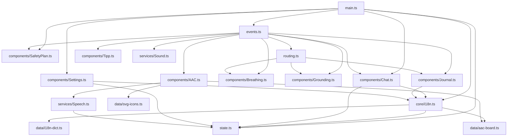
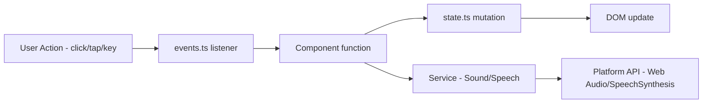

# Marea World-Class — Phase 1: Vite + TypeScript + Tests

## Current Architecture (Baseline)

```
marea/
├── index.html          (467 lines) — Monolithic SPA, all 6 tabs as <section>
├── app.js              (941 lines) — All logic in one DOMContentLoaded callback
├── i18n.js             (1349 lines) — Pure data: i18n dict + AAC board data
├── styles.css          (1324 lines) — Single stylesheet, CSS custom properties
├── sound.js            (138 lines)  — OceanSynth class (Web Audio API)
├── service-worker.js   (~60 lines) — Network-first SW
├── manifest.json       (35 lines)   — PWA manifest
├── favicon.svg         — SVG favicon
├── icon-*.png          — 4 PWA icons (192/512, regular/maskable)
└── .github/workflows/deploy.yml — Cloudflare Pages via wrangler
```

**Critical constraints:**
- No build step currently → `wrangler pages deploy .` deploys raw files
- Cloudflare Pages project `marea-tide` is "Direct Upload" type
- All i18n is inline data, no dynamic imports
- State is 100% vanilla JS object, no framework

---

## Target Architecture

```
marea/
├── index.html              (preserved, moved to root of src)
├── public/
│   ├── favicon.svg
│   ├── icon-192.png
│   ├── icon-192-maskable.png
│   ├── icon-512.png
│   ├── icon-512-maskable.png
│   ├── manifest.json
│   └── service-worker.js
├── src/
│   ├── main.ts             (entry point — replaces app.js DOMContentLoaded)
│   ├── types.ts            (all shared TypeScript interfaces)
│   ├── state.ts            (reactive state singleton)
│   ├── core/
│   │   ├── i18n.ts         (translation engine + static data)
│   │   ├── toast.ts        (toast notification system)
│   │   └── dom.ts          (safe DOM queries with type assertions)
│   ├── components/
│   │   ├── Chat.ts         (chat state machine, quick replies, timer)
│   │   ├── Breathing.ts    (box breathing 4-4-4-4 guide)
│   │   ├── Grounding.ts    (5-4-3-2-1 sensory wizard)
│   │   ├── Tipp.ts         (cold water TIPP timer)
│   │   ├── AAC.ts          (AAC board, SVG icons, speech)
│   │   ├── SafetyPlan.ts   (safety anchors, localStorage persistence)
│   │   ├── Journal.ts      (sensory canvas + slider syncing)
│   │   └── Settings.ts     (language, theme, hand mode, sensory toggle, wipe)
│   ├── services/
│   │   ├── Sound.ts        (OceanSynth → migrated from sound.js)
│   │   └── Speech.ts       (TTS wrapper — voice loading, fallback)
│   ├── data/
│   │   ├── i18n-dict.ts    (8-language translation dictionary)
│   │   ├── aac-board.ts    (AAC board data for all languages)
│   │   └── svg-icons.ts    (SVG icon paths extracted from getAacSvgIcon)
│   └── styles/
│       ├── main.css        (1:1 migration of styles.css with @import)
│       ├── tokens.css      (CSS custom properties — :root + themes)
│       ├── layout.css      (app frame, header, navbar, grid)
│       ├── components.css  (chat, breathing, grounding, tipp, AAC, safety, journal)
│       └── settings.css    (settings panel, sensory mode, themes)
├── tests/
│   ├── unit/
│   │   ├── state.test.ts
│   │   ├── i18n.test.ts
│   │   ├── chat-machine.test.ts
│   │   ├── breathing.test.ts
│   │   ├── grounding.test.ts
│   │   ├── tipp-timer.test.ts
│   │   └── speech.test.ts
│   └── a11y/
│       └── axe.spec.ts     (Playwright + @axe-core/playwright)
├── vite.config.ts
├── tsconfig.json
├── vitest.config.ts
├── playwright.config.ts
├── package.json
└── .github/workflows/deploy.yml  (updated for Vite build)
```

---

## Step 1: Vite + TypeScript Scaffold

### 1.1 `package.json`

```json
{
  "name": "marea",
  "version": "1.0.0",
  "private": true,
  "type": "module",
  "scripts": {
    "dev": "vite",
    "build": "tsc && vite build",
    "preview": "vite preview",
    "test": "vitest run",
    "test:watch": "vitest",
    "test:a11y": "playwright test"
  },
  "devDependencies": {
    "vite": "^6.x",
    "typescript": "^5.7",
    "vitest": "^3.x",
    "playwright": "^1.x",
    "@axe-core/playwright": "^4.x"
  }
}
```

### 1.2 `vite.config.ts`

```ts
import { defineConfig } from 'vite';

export default defineConfig({
  root: '.',                    // index.html at project root
  publicDir: 'public',
  build: {
    outDir: 'dist',
    target: 'es2020',           // Broad mobile support
    cssMinify: 'lightningcss',  // Fast CSS minification
    rollupOptions: {
      output: {
        manualChunks: {
          data: ['src/data/i18n-dict.ts', 'src/data/aac-board.ts']
        }
      }
    }
  }
});
```

### 1.3 `tsconfig.json`

```json
{
  "compilerOptions": {
    "target": "ES2020",
    "module": "ESNext",
    "moduleResolution": "bundler",
    "strict": true,
    "noUncheckedIndexedAccess": true,
    "esModuleInterop": true,
    "skipLibCheck": true,
    "forceConsistentCasingInFileNames": true,
    "outDir": "dist",
    "rootDir": ".",
    "types": ["vitest/globals"]
  },
  "include": ["src/**/*.ts", "tests/**/*.ts"]
}
```

---

## Step 2: Type System Design

Defined in [`src/types.ts`](src/types.ts) — these interfaces capture every piece of mutable state currently scattered in the `state` object.

```ts
// ===== Language & Theme =====
export type Lang = 'es' | 'en' | 'it' | 'fr' | 'de' | 'zh' | 'pt' | 'ja';
export type Theme = 'deep-sea' | 'warm-sand' | 'high-contrast' | 'monochrome';
export type HandMode = 'right' | 'left' | 'center' | 'motor-right' | 'motor-left' | 'motor-center';

// ===== Chat =====
export type ChatSender = 'system' | 'user';
export type QuickReplyKey = 'underwater' | 'cant_breathe' | 'want_cry' | 'rumination' | 'exhausted' | 'just_stay';
export type IntentKey = 'how' | 'anxiety' | 'speech' | 'default_0' | 'default_1' | 'default_2' | 'default_3' | 'default_4';

export interface ChatMessage {
  text: string;
  sender: ChatSender;
}

// ===== Breathing =====
export type BreathingPhase = 0 | 1 | 2 | 3; // Idle, Inhale, Hold Full, Exhale, Hold Empty

// ===== Grounding =====
export interface GroundingStep {
  num: number;
  key: string;
}

// ===== AAC =====
export type AacCategory = 'needs' | 'social' | 'emotions';

export interface AacItem {
  text: string;
  spoken: string;
  icon: string;
}

// ===== Journal =====
export interface JournalEntry {
  date: string;           // ISO date YYYY-MM-DD
  light: string;          // 1-5 slider value
  sound: string;
  pressure: string;
  pain: string;
  rumination: string;
}

// ===== App State (complete) =====
export interface AppState {
  lang: Lang;
  theme: Theme;
  handMode: HandMode;
  sensoryMode: boolean;
  activeTab: string;
  activeAnchorSubtab: string;
  
  // Chat
  chatTimer: ReturnType<typeof setTimeout> | null;
  chatMessages: ChatMessage[];
  lastDefaultIndex: number;
  
  // Breathing
  breathingInterval: ReturnType<typeof setInterval> | null;
  breathingPhase: BreathingPhase;
  breathingCycles: number;
  
  // Grounding
  groundingStep: number;
  
  // TIPP
  tippTimerInterval: ReturnType<typeof setInterval> | null;
  tippTimeRemaining: number;
  
  // AAC
  aacActiveCategory: AacCategory;
}

// ===== i18n Dictionary =====
export type I18nDict = Record<Lang, Record<string, string>>;
export type AacBoardDict = Record<Lang, Record<AacCategory, AacItem[]>>;
```

---

## Step 3: Module Decomposition (1:1 behavior preservation)

### 3.1 `src/data/` — Pure data, zero logic

- **`i18n-dict.ts`**: Copy-paste the `i18n` object from `i18n.js:7-1088`, add `as const satisfies Record<Lang, Record<string, string>>`.
- **`aac-board.ts`**: Copy-paste `aacBoardData` from `i18n.js:1091-1348`, typed.
- **`svg-icons.ts`**: Extract the `icons` object from `getAacSvgIcon()` (lines 508-533). Pure data, no function.

### 3.2 `src/core/` — Shared utilities

- **`toast.ts`**: Lines 8-21 from app.js. `export function showToast(message: string): void`.
- **`dom.ts`**: Type-safe DOM getters. Instead of raw `document.getElementById()` with null checks everywhere, provide:
  ```ts
  export function getEl<T extends HTMLElement>(id: string): T { ... }
  export function getEls<T extends HTMLElement>(selector: string): NodeListOf<T> { ... }
  ```
- **`i18n.ts`**: Lines 121-157 from app.js. `translateApp()`, `t(key)`. Reads state.lang.

### 3.3 `src/state.ts` — Singleton reactive state

```ts
import type { AppState } from './types';

export const state: AppState = { /* ... initial values ... */ };

// Persistent state loader
export function loadPersistedState(): void {
  state.lang = (localStorage.getItem('marea_lang') as Lang) || 'es';
  state.theme = (localStorage.getItem('marea_theme') as Theme) || 'deep-sea';
  state.handMode = (localStorage.getItem('marea_hand') as HandMode) || 'right';
  state.sensoryMode = localStorage.getItem('marea_sensory') === 'true';
}
```

### 3.4 `src/components/` — One module per tab/feature

Each component exports an `init()` function called from `main.ts`. This mirrors the current pattern where everything runs inside `setupEventListeners()` + specific init functions.

| Module | Lines migrated | Key exports |
|--------|---------------|-------------|
| `Chat.ts` | 223-347 | `initChat()`, `handleUserMsg()`, `addChatBubble()` |
| `Breathing.ts` | 350-420 | `startBreathingGuide()`, `stopBreathingGuide()` |
| `Grounding.ts` | 423-465 | `renderGroundingStep()` |
| `Tipp.ts` | 467-503 | `startTippTimer()`, `resetTippTimer()` |
| `AAC.ts` | 506-610 | `renderAACBoard()`, `speakText()`, `getAacSvgIcon()` |
| `SafetyPlan.ts` | 613-624 | `loadSafetyPlan()`, `saveSafetyPlan()` |
| `Journal.ts` | 627-711 | `drawSensoryCanvas()` |
| `Settings.ts` | 714-799 | `initSettings()`, `applyHandMode()`, `applySensoryMode()`, `applyTheme()` |

### 3.5 `src/services/` — Platform abstractions

- **`Sound.ts`**: Move `OceanSynth` class from `sound.js`. No logic changes, just add types.
- **`Speech.ts`**: Refactor `speakText()` (lines 578-610). Add `voiceschanged` listener for deferred voice loading. Add visual fallback when TTS unavailable.

### 3.6 `src/main.ts` — Entry point

```ts
import { loadPersistedState, state } from './state';
import { translateApp } from './core/i18n';
import { initChat } from './components/Chat';
import { initSettings } from './components/Settings';
import { loadSafetyPlan } from './components/SafetyPlan';
import { setupEventListeners } from './events';

loadPersistedState();
document.addEventListener('DOMContentLoaded', () => {
  translateApp();
  setupEventListeners();
  initSettings();
  initChat();
  loadSafetyPlan();

  if ('serviceWorker' in navigator) {
    window.addEventListener('load', () => {
      navigator.serviceWorker.register('./service-worker.js');
    });
  }
});
```

### 3.7 `src/events.ts` — Centralized event binding

Lines 802-923 from app.js. Each listener delegates to the appropriate component:
```ts
import { switchTab } from './routing';
import { handleUserMsg } from './components/Chat';
// ... etc

export function setupEventListeners(): void {
  // Tab navigation
  document.querySelectorAll('.nav-item').forEach(btn => { ... });
  // Chat
  getEl('chat-send-btn').addEventListener('click', () => { ... });
  // Breathing
  getEl('toggle-ocean-sound').addEventListener('click', () => { ... });
  // ... all 20+ listeners
}
```

### 3.8 `src/routing.ts` — Tab/subtab navigation

Lines 160-220 from app.js. `switchTab()` and `switchAnchorSubtab()`.

### 3.9 CSS split strategy

Current `styles.css` (1324 lines) → modular CSS with `@import`:

```
src/styles/
  tokens.css      → :root, .theme-* variables (lines 7-~350)
  layout.css      → .app-container, .app-header, .app-navbar, grid
  components.css  → .chat-*, .breathing-*, .grounding-*, .tipp-*, .aac-*, .safety-*, .journal-*
  settings.css    → .settings-*, .manifesto-*
  main.css        → @import url('./tokens.css'); @import ...; (then animations, media queries kept here)
```

Vite will bundle `@import` into a single CSS file during build, keeping the same output as today.

### 3.10 HTML migration

`index.html` moves to project root. No structural changes. Only change: 
```html
<!-- Before -->
<script src="app.js"></script>

<!-- After -->
<script type="module" src="/src/main.ts"></script>
```

All `data-i18n` and `data-i18n-placeholder` attributes preserved exactly.

---

## Step 4: Testing Strategy

### 4.1 Unit Tests (Vitest)

Focus on pure logic functions that don't touch DOM:

| Test file | What it covers | Source |
|-----------|---------------|--------|
| `state.test.ts` | State initialization, persistence load/save | `state.ts` |
| `i18n.test.ts` | `t()` fallback behavior, all 8 languages have all keys referenced in HTML | `i18n.ts`, `i18n-dict.ts` |
| `chat-machine.test.ts` | Intent classifier regex across all 8 languages, default reply cycling | `Chat.ts:273-323` |
| `breathing.test.ts` | Phase transitions (0→1→2→3→0), cycle counting | `Breathing.ts` |
| `grounding.test.ts` | Step progression (0-5), "done" state rendering strings | `Grounding.ts` |
| `tipp-timer.test.ts` | Countdown logic, reset behavior | `Tipp.ts` |
| `speech.test.ts` | Language mapping, voice selection fallback logic | `Speech.ts` |

### 4.2 Accessibility Tests (Playwright + axe-core)

```ts
// tests/a11y/axe.spec.ts
import { test, expect } from '@playwright/test';
import AxeBuilder from '@axe-core/playwright';

const TABS = ['refugio', 'ancla', 'voz', 'seguridad', 'diario', 'settings'];

for (const tab of TABS) {
  test(`Tab ${tab} passes WCAG 2.1 AA`, async ({ page }) => {
    await page.goto('/');
    await page.click(`[data-tab="${tab}"]`);
    const results = await new AxeBuilder({ page })
      .withTags(['wcag2a', 'wcag2aa'])
      .analyze();
    expect(results.violations).toEqual([]);
  });
}
```

### 4.3 `vitest.config.ts`

```ts
import { defineConfig } from 'vitest/config';

export default defineConfig({
  test: {
    globals: true,
    environment: 'jsdom',       // For DOM-dependent tests
    include: ['tests/unit/**/*.test.ts']
  }
});
```

---

## Step 5: CI/CD Update

### 5.1 Updated `.github/workflows/deploy.yml`

```yaml
name: MAREA CI/CD — Test, Build & Deploy to Cloudflare Pages

on:
  push:
    branches: [main]
  pull_request:
    branches: [main]
  workflow_dispatch:

jobs:
  test:
    name: Test & Lint
    runs-on: ubuntu-latest
    steps:
      - uses: actions/checkout@v4
      - uses: actions/setup-node@v4
        with:
          node-version: '20'
          cache: 'npm'
      - run: npm ci
      - run: npm test
      - run: npx tsc --noEmit

  deploy:
    name: Deploy to Cloudflare Pages
    needs: test
    if: github.ref == 'refs/heads/main' || github.event_name == 'workflow_dispatch'
    runs-on: ubuntu-latest
    steps:
      - uses: actions/checkout@v4
      - uses: actions/setup-node@v4
        with:
          node-version: '20'
          cache: 'npm'
      - run: npm ci
      - run: npm run build
      - name: Deploy to Cloudflare Pages
        run: |
          export CLOUDFLARE_API_TOKEN="${{ secrets.MAREA }}"
          export CLOUDFLARE_ACCOUNT_ID="5df89a67326725077c0c1e7a6d7c9328"
          npx wrangler pages deploy dist/ --project-name=marea-tide --commit-dirty=true
```

Key change: deploy from `dist/` instead of `.`. The `--commit-dirty=true` flag is preserved since the project is Direct Upload type.

### 5.2 `.gitignore` update

Add:
```
node_modules/
dist/
.vite/
test-results/
playwright-report/
```

---

## Step 6: Migration Approach (Incremental, not Big Bang)

The migration MUST preserve a working deploy at every commit. Strategy:

### Phase 1a — Scaffold (no behavior change)
1. Run `npm init`, install vite + typescript (dev deps only)
2. Create `vite.config.ts`, `tsconfig.json`, `vitest.config.ts`
3. Move static assets to `public/`
4. **At this point:** `npx vite build` produces identical output. Deploy still works.

### Phase 1b — Extract data (no behavior change)
5. Create `src/data/i18n-dict.ts`, `src/data/aac-board.ts`, `src/data/svg-icons.ts`
6. Remove data from `i18n.js`, import from new modules
7. **Test:** All tabs still render all 8 languages.

### Phase 1c — Extract types and state
8. Create `src/types.ts`
9. Create `src/state.ts` with `loadPersistedState()`
10. **Test:** Theme switching, language switching, sensory mode all work.

### Phase 1d — Extract core utilities
11. Create `src/core/toast.ts`, `src/core/dom.ts`, `src/core/i18n.ts`
12. Wire into `app.js` via imports

### Phase 1e — Extract components (one per commit)
13. `Breathing.ts` → test breathing cycle
14. `Grounding.ts` → test wizard steps
15. `Tipp.ts` → test timer
16. `AAC.ts` → test board + speech
17. `SafetyPlan.ts` → test persistence
18. `Journal.ts` → test canvas + sliders
19. `Settings.ts` → test all settings
20. `Chat.ts` → test full chat flow

### Phase 1f — Final wiring
21. Create `src/routing.ts`
22. Create `src/events.ts`
23. Create `src/main.ts`
24. Update `index.html` script tag to `type="module"`
25. Write unit tests for all pure functions
26. Write Playwright a11y smoke tests
27. Update CI/CD

---

## Mermaid: Module Dependency Graph



## Mermaid: Data Flow (User Action → State → DOM)



---

## Risk Registry

| Risk | Mitigation |
|------|-----------|
| TypeScript `strict` breaks implicit `any` in language detection regex | Add explicit `string` types to all regex test inputs |
| Vite module splitting changes URL paths → SW cache misses | Keep same output structure; service worker caches `dist/` contents |
| `wrangler pages deploy dist/` fails on Direct Upload projects | Test on first commit; fallback: keep deploying `.` and have Vite output to root-level `dist/` that we copy back |
| CSS `@import` changes cascade order | Test visual regression on all 4 themes × 6 tabs after split |
| SpeechSynthesis `voiceschanged` event timing varies across browsers | Keep synchronous `getVoices()` call + add `voiceschanged` listener for deferred load |
| Large i18n data bloat in initial bundle | Already addressed: `manualChunks` splits data into separate chunk |
